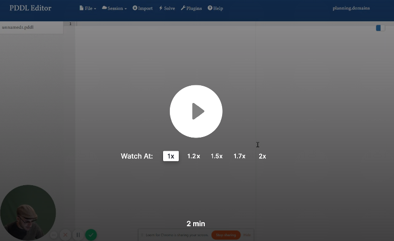
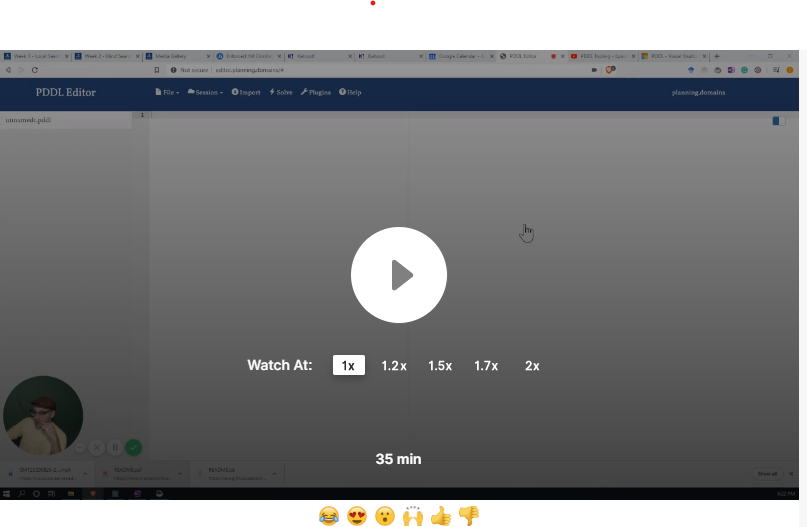

# COMP90054 AI Planning for Autonomy - Project 2 - PDDL modelling 

You must read fully and carefully the assignment specification and instructions detailed in this file. You are NOT to modify this file in any way.

* **Course:** [COMP90054 AI Planning for Autonomy](https://handbook.unimelb.edu.au/subjects/comp90054) @ Semester 2, 2022
* **Instructor:** Dr. Nir Lipovetzky and Prof. Adrian Pearce
* **Deadline:** Monday 5th September, 2022 @ 11:59pm (Start of Week 7)
* **Course Weight:** 10%
* **Assignment type:**: Individual
* **ILOs covered:** 1, 2, and 3
* **Submission method:** via git tagging (see Submission Instructions below for instructions)
* **Extensions:** For extension applications, email Nir: <nir.lipovetzky@unimelb.edu.au>. Maximum extension of 24h due to next assesment coming up between Wednesday-Friday of Week 7.

The **aim of this project** is to improve your understanding of PDDL modelling.

## Task

**Your task** is to read the description of the the domain below and encode the three planning problem instances specified filling the template files provided in this repository in the folder [pddl_template](pddl_template). See more information in the [Deliverables & Rubric](#deliverables--rubric) section.

## The Domain - Real Player Game

 *Help the hero to get out of a maze known as the UpsideDown!*
 
 A hero woke up in the UpsideDown (perhaps the party last night went wrong...), and wants to return home to Melborune. The UpsideDown is a maze full of Demogorgons (monsters) and gates. The Hero needs your help to close all the gates in order to make sure monsters will not go back to Melbourne, and then get back home. I.e. The hero has to get home and close all gates.  Here are basic facts for the UpsideDown domain:
- The UpsideDown contains rooms that are **connected** by corridors (UpsideDown can thus be represented by an undirected graph),
- each room can be **empty**, or can have a **Demogorgon**, a **key** or/and a **match** in it,
- one of the empty rooms is **home**: where the hero really wants to be.

The hero is lucky since she/he has full knowledge about the UpsideDown. But not that lucky – just after the hero leaves each room she visits, the room is **invigilated** by **Vecna** (the bad guy) and cannot be visited again.

The hero can perform the following actions – but only if s/he is alive!
- The hero can **move** to an adjacent room (connected by a corridor) that has not been invigilated (i.e., the hero has not already visited the room). If the hero moves into a room with a monster, she needs to be holding a match.
- **Pickup** a match or a key if present in the room the hero is currently in and the hero is empty handed
- **Drop** a match or a key, it will become present in the room, and the hero will have the hands free to pickup a key or a match.
- **Strike a match**. The hero can move into a room with a monster **but**, before leaving the room, it needs to strike a match, as the monster will eat the hero otherwise. For some reason, monsters are affraid of fire. The fire of a match lasts only until the hero moves. I.e. if a match is on fire, once the character moves, the match will go off. Once the match has been used, it doesn't disappear, you have to drop it if you want to pick up another object.
- **Close a Gate** – if there is a gate in an adjacent room to the current room where the hero is in, the hero is holding the correct color key, and the key has still some uses available, then the hero can close the gate. The hero can move through rooms with closed gates as long as she hasn't moved through that room yet. Once a gate is closed, the counter of how many times the key can be used will be decreased. Once a key has been used to completion, it doesn't dissapear, the character needs to drop it if she wants to use another key or pickup another match. Keys can be:
    - Single-use keys, can be used only once.
    - Double-use Keys, can be used twice.
    - Master Keys, can be used infinitely often.

**Important:** We recommend reading the description carefully several times to make sure you fully understand it before starting coding in PDDL.

## Legend

The problems you need to implement are defined by the following graphs using the legend below, Good luck![^1]

 

[^1]: Icons acknowledgement: https://www.pngkey.com/maxpic/u2q8w7a9e6o0q8r5/

### Problem 1

### Problem 2

### Problem 3

<!-- # Planimated Example Solution
 -->

## Deliverables & Rubric

[PDDL templates](pddl_template) are provided for the domain and problem instances. You can use the classical propositional STRIPS subset of PDDL + negative preconditions and conditional effects. You will fill these out and submit them for this assignment. *Types, constants, objects*, and all *actions* will be given. Do not change any of the above items. You are responsible for the *action preconditions/effects, predicates, initial state, and goal state* for the domain and problem files. The first three problems are provided visually above. The final element is to create your own problem file / setting, and ensure that it has the following properties:
1. The number of rooms is between 5 and 10,
2. The hero needs to walk through all rooms,
3. There is at least one open gate of every colour.

In order to hand in this assignment, fill in your domain file and 4 problem files in the pddl_template folder. For more informaiton, read the [Submission Instructions](#submission-instructions) section below.

This assignment has a weight of 10% over the final grade. The criteria for marking will be:

- 6 points for encoding the domain correctly. Each correct action counts 0.66 points. If a precondition or effect is missing from an action, the action will earn 0 points.
- 4 point for encoding the 4 problems correctly
- Note that while you’ll need to create your own fluents, the correctness of these will be assessed as part of the action PDDL you write – there may be several ways to model things.

**Important:** Make sure to tag your commit with your updated pddl files inside that folder.

## How to get started

Once you clone the files from this repository onto your local machine, watch the following videos on how to get started. Open the [pddl_template](pddl_template) folder and start modeling.

Visual Studio and VSCode are recommended tools for this project, as they have excellent PDDL integration. Alternatively, go to editor.planning.domains in your web browser. Below you can watch videos demonstrating the capability of both.

**Note**: The video was recorded in 2020, and so the example PDDL is not for this assignment.

### Upload to Editor.planning.domains, how to save a session and work online

### Download session offline with vscode and call the online planner

### Work with VScode directly and the online planner

### PDDL Tutorials

Live modeling session in PDDL:

VScode PDDL Tutorial: 

## Submission Instructions

**Tag your submission** to submit your assignment by completing the following three steps:

1. Complete the [STUDENT.md](STUDENT.md) file with your details of the submission.
2. Please ensure that your solution does not include personal information, like your student number or name. 
3. Tag the commit version you want to be graded with tag `submission`. 
    * The commit and tagging should be dated before the deadline.
    * Note that a tag is NOT a branch, so do not just create a branch called "submission" as that will not amount to tagging.
4. Fill the [Project 2 Certification Form](https://forms.gle/yGkdDuaFjnsTnVpeA).
    * Non-certified submissions will not be marked and will attract zero marks.
    
From this repository, we will copy *only* the PDDL files: [domain.pddl](pddl_template/domain.pddl), [problem1.pddl](pddl_template/problem1.pddl), [problem2.pddl](pddl_template/problem2.pddl), [problem3.pddl](pddl_template/problem3.pddl),  and [problem4.pddl](pddl_template/problem4.pddl). Please do not submit any other file with a different name as part of your solution, we will not be able to mark it. Breaking these instructions breaks our marking scripts, delays marks being returned, and more importantly, gives us a headache. Submissions not compatible with the instructions in this document will attract zero marks and do not warrant a re-submission. Staff will not fix your submission.

Please view the following to learn how to *Tag* your commit version you want to be graded:

**How to create a Tag using the Command Line**:
https://www.loom.com/share/17ec72b954454bc89bbe1dbb0bd2874f

**Another way to create a Tag using the User Interface**:
https://www.loom.com/share/3cd39e97919e4b688d9841613aba6973

## Important information

**Corrections:** From time to time, students or staff find errors (e.g., typos, unclear instructions, etc.) in the assignment specification. In that case, corrected version of this file will be produced, announced, and distributed for you to commit and push into your repository.  Because of that, you are NOT to modify this file in any way to avoid conflicts.

**Late submissions & extensions:** A penalty of 10% of the maximum mark per day will apply to late assignments up to a maximum of five days, and 100% penalty thereafter. Extensions will only be permitted in _exceptional_ circumstances; refer to [this question](https://docs.google.com/document/d/17YdTmDC54WHq0uZ-2UX3U8ESwULyBDJSD4SjKCrPXlA/edit?usp=sharing) in the course FAQs. 

**About this repo:** You must ALWAYS keep your fork **private** and **never share it** with anybody in or outside the course, except your teammates, _even after the course is completed_. You are not allowed to make another repository copy outside the provided GitHub Classroom without the written permission of the teaching staff. 

> **_Please do not distribute or post solutions to any of the projects._**

**Academic Dishonesty:** This is an advanced course, so we expect full professionalism and ethical conduct.  Plagiarism is a serious issue. Please **don't let us down and risk our trust**. The staff take academic misconduct very seriously. Sophisticated _plagiarism detection_ software (e.g., [Codequiry](https://codequiry.com/), [Turinitin](https://www.turnitin.com/), etc.) will be used to check your code against other submissions in the class as well as resources available on the web for logical redundancy. These systems are really smart, so just do not risk it and keep professional. We trust you all to submit your own work only; please don't let us down. If you do, we will pursue the strongest consequences available to us according to the **University Academic Integrity policy**. For more information on this see file [Academic Integrity](ACADEMIC_INTEGRITY.md).

**We are here to help!:** We are here to help you! But we don't know you need help unless you tell us. We expect reasonable effort from you side, but if you get stuck or have doubts, please seek help. We will ran labs to support these projects, so use them! While you have to be careful to not post spoilers in the forum, you can always ask general questions about the techniques that are required to solve the projects. If in doubt whether a questions is appropriate, post a Private post to the instructors.

**Silence Policy:** A silence policy will take effect **48 hours** before this assignment is due. This means that no question about this assignment will be answered, whether it is asked on the newsgroup, by email, or in person. Use the last 48 hours to wrap up and finish your project quietly as well as possible if you have not done so already. Remember it is not mandatory to do all perfect, try to cover as much as possible. By having some silence we reduce anxiety, last minute mistakes, and unreasonable expectations on others. 

Please remember to follow all the submission steps as per project specification.

## COMP90054 Code of Honour

We expect every UoM student taking this course to adhere to it **Code of Honour** under which every learner-student should:

* Submit their own original work.
* Do not share answers with others.
* Report suspected violations.
* Engage in any other activities that will dishonestly improve their results or dishonestly improve or damage the results of others.

Unethical behaviour is extremely serious and consequences are painful for everyone. We expect enrolled students/learners to take full **ownership** of your work and **respect** the work of teachers and other students.

**I hope you enjoy the project and learn from it**, and if you still **have doubts about the project and/or this specification** do not hesitate asking in the [ED Course Discussion Forum](https://edstem.org/au/dashboard) and we will try to address it as quickly as we can!

**GOOD LUCK and HAPPY MODELLING!**

### Acknowledgements

A variant of this problem was originally proposed at _The Fifth International Competition on Knowledge Engineering for Planning and Scheduling_ [ICKEPS 2016](https://ickeps2016.wordpress.com/scenarios/). Author: [Lukas Chrpa](http://ktiml.mff.cuni.cz/~chrpa/), Charles University in Prague. 

If you want to practice modeling other domains, take a look at the [other problems](https://helios.hud.ac.uk/scommv/ICKEPS/Scenarios.pdf) presented in the competition. All but the first one can be modeled using STRIPS and actions costs.
